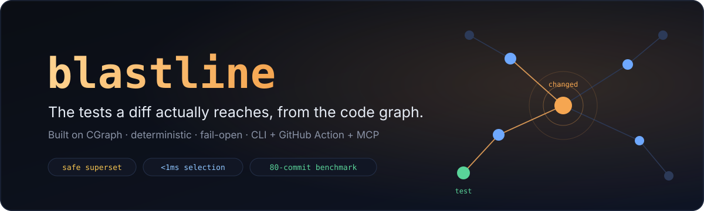

<div align="center">



[](https://www.npmjs.com/package/blastline)
[](LICENSE)
[](tsconfig.json)
[](https://github.com/Nxtsoft/blastline/actions)
[](https://github.com/Nxtsoft/blastline/actions/workflows/safety-audit.yml)
[](https://modelcontextprotocol.io)
[](https://github.com/Nxtsoft/CGraph)
[](#contributing)

*Diff in · impacted tests and blast radius out · deterministic, fail-open, served by a [CGraph](https://github.com/Nxtsoft/CGraph) code graph.*

</div>

## Contents

[Why blastline?](#why-blastline) ·
[How selection works](#how-selection-works) ·
[Benchmarks](#benchmarks) ·
[Quick start](#quick-start) ·
[GitHub Action](#github-action) ·
[Use with coding agents](#use-with-coding-agents) ·
[CLI reference](#cli-reference) ·
[Status & roadmap](#status--roadmap) ·
[Contributing](#contributing) ·
[License](#license)

## Why blastline?

Deciding which tests a diff needs means knowing what the change *reaches* — and that answer lives in the relationships between files, not in the diff. Every existing test-impact tool is locked to one build system (Bazel, Nx), one language via coverage instrumentation (pytest-testmon), or a closed SaaS. blastline computes it from a deterministic code graph instead, so it works on any repo CGraph can extract.

| | |
| --- | --- |
| 🎯 **Impacted tests, not guesses** | Changed lines map to graph symbols; a transitive-dependents walk finds every test that reaches them. `blastline tests main..HEAD \| xargs vitest run` runs exactly those. |
| 💥 **Blast radius on every PR** | The GitHub Action comments each PR with the change's transitive dependents, with `file:line` — the reviewer sees what the diff touches before reading it. |
| 🛡️ **Safe superset, fail-open** | The contract is "run *at least* these," never "safe to skip." Unmapped files, a stale graph, an under-extracted graph, or an oversized diff all fail open to a full run, with machine-readable reasons. |
| ⚡ **Deterministic & instant** | Selection is pure graph traversal: same repo state + same diff → byte-identical output, in under a millisecond on a built graph. No ML ranking, no coverage run. |
| 🤖 **Built for coding agents** | `blastline mcp` serves `blastline_tests` / `blastline_blast` over MCP, so an agent checks what its edit reaches *before* opening the PR. |

> **The pitch in one line:** test-impact analysis is a graph-reachability problem — blastline is the reachability query, packaged as a CLI, a PR comment, and an MCP tool, with fail-open honesty when the graph can't vouch for a diff.

## How selection works

```
git diff --unified=0 base..head
   → changed line ranges                (src/diff.ts)
   → innermost graph node per line      (src/mapping.ts — whole-file adds seed every symbol)
   → transitive dependents walk         (src/impact.ts — CALLS, imports, re_exports, contains, inherits;
                                          dispatch barrier: interface contracts propagate to callers only)
   → intersect with test files          (src/detect.ts — JS/TS, pytest, Go, C/C++ conventions)
   → subset + blast radius, or ALL with reasons
```

Fail-open triggers, each a typed reason in the output:

| Reason | Fires when |
| --- | --- |
| `unmapped-file` | a changed file has no graph node (configs, lockfiles, assets) — declare irrelevant paths with `--ignore` |
| `stale-graph` | the graph fails a content-root pin (`--expect-root`, or `--daemon-verify` against the live CGraph daemon), or `graph.json` is older than the head commit |
| `sparse-graph` | the graph averages under 3 edges per file — an under-extracted graph produces subsets that look smart and are blind, so blastline refuses |
| `disconnected-tests` | tests can forward-reach under 25% of the code's symbols — the graph passed the density floor but is blind for selection (how broken Go/Python extraction presents) |
| `diff-too-large` | the diff touches more files than `--max-files` (default 200) |
| `graph-unavailable` | no readable `graph.json` |

Pure deletions map against a `--base-graph` when supplied, and degrade to the file node (a superset-safe approximation) when not.

## Benchmarks

Replayed the last 20 first-parent commits of two repos, scoring every selection against the tests each commit's author co-changed ([methodology and full tables](openspec/changes/bootstrap-blastline/bench-results.md)):

| | production Next.js app | es-toolkit (1,508 files) |
| --- | --- | --- |
| subset rate | 19/20 | 18/20 |
| co-changed tests selected | 21/22¹ | **41/41** |
| mean selection | 25.7% of suite | 4.7% of ~670 tests |
| deterministic (double-run) | yes | yes |

¹ The one "miss" is a false positive of the co-change proxy itself — the author added new tests for unchanged code.

The benchmark also caught CGraph silently deleting 650 of es-toolkit's 1,508 files from the graph ([CGraph #39](https://github.com/Nxtsoft/CGraph/issues/39)/[#40](https://github.com/Nxtsoft/CGraph/issues/40), fixed in [#42](https://github.com/Nxtsoft/CGraph/pull/42)) — before the fix, blastline's sparse-graph guard correctly refused to produce subsets there. That loop is the design working: guard until the graph is trustworthy, select once it is.

### The safety audit

Replay benchmarks are a snapshot; the **safety audit** is the standing check. On every push to this repo's `main`, [safety-audit.yml](.github/workflows/safety-audit.yml) replays blastline's selection for the pushed range, runs the **full** suite, and records whether any failing test file fell *outside* the selection — an **escape**, the one outcome "safe superset" forbids. Each run appends a JSONL record to the [`safety-ledger`](https://github.com/Nxtsoft/blastline/tree/safety-ledger) branch and rolls the ledger into the badge above; a recorded escape turns it red and fails the run loudly. The evidence accumulates with every merge instead of resting on a one-time benchmark.

## Quick start

Prerequisites: Node 20+, a [CGraph](https://github.com/Nxtsoft/CGraph) binary on PATH, and a git repo.

```sh
npm install -g blastline        # or zero-install: npx blastline ...

cgraph --root ./src --out cgraph-out          # build the graph once
blastline tests main..HEAD | xargs vitest run
blastline blast main..HEAD                    # dependents with file:line
```

Working from source (contributors): `git clone https://github.com/Nxtsoft/blastline && cd blastline && bun install && bun run build`, then `node dist/cli.js …`.

## GitHub Action

Zero-config — point it at your source root and the Action installs CGraph and builds the graph itself:

```yaml
- uses: actions/checkout@v4
  with:
    fetch-depth: 0
- uses: Nxtsoft/blastline@v0
  id: blastline
  with:
    graph-root: src                     # builds + caches the graph itself, no graph.json required
    github-token: ${{ github.token }}   # posts/updates the PR comment
```

Bring your own graph instead with `graph-path` — e.g. a monorepo build step, or when you also want `base-graph-command`'s deletion mapping. The two are mutually exclusive; the Action fails loudly if both are set:

```yaml
- uses: actions/checkout@v4
  with:
    fetch-depth: 0
- uses: Nxtsoft/blastline@v0
  id: blastline
  with:
    graph-path: cgraph-out/graph.json
    base-graph-command: cgraph --root . --out "$BLASTLINE_BASE_OUT"
    github-token: ${{ github.token }}   # posts/updates the PR comment
    ignore: |
      \.md$
      ^docs/
```

Outputs: `kind` (`subset` or `all`) and `tests` (newline-separated files), so a downstream job can run only the selected tests. The comment shows the impacted tests and a collapsible blast radius; on fail-open it says "run the full suite" and why. With `graph-root`, the build is cached via `actions/cache` keyed on the tree hash of `graph-root` (`git rev-parse HEAD:<graph-root>`) rather than the graph's own content-root hash, since that hash lives inside `graph.json` and isn't known until after the build runs. `cgraph-version` (default `bin-v0.1.0`) pins the `Nxtsoft/CGraph` release tag the turnkey build installs from; currently Linux x64 runners only. With `graph-path`, supply your own graph from a cache keyed on your source tree, or let the run fail open honestly when no graph exists.

`base-graph-command` automates deletion mapping: the action checks out the
range's base commit into a worktree, runs your graph-build command there (it
must write `$BLASTLINE_BASE_OUT/graph.json`), and passes the result as the base
graph. A PR that deletes a file then selects the surviving tests that depended
on the deleted symbols, instead of failing open on an unmapped path — the
deleted code exists only in the base graph, so its dependents are walked there
and translated back to head paths. Skip the input and deletions keep the
documented safe degradation.

## Cross-repo selection over seam graphs

For microservice estates, point blastline at a [CGraph seam](https://github.com/Nxtsoft/CGraph) — the fused graph that joins per-service code graphs at their wire contracts:

```sh
cgraph seam gen  --seam seam.json --graphs backend=backend/graph.json --out drop
cgraph seam fuse --seam drop/chunk_00.json   --graph backend=backend/graph.json --graph ml-api=ml-api/graph.json --out fused

blastline tests main..HEAD --repo ./ml-api --graph fused/graph.json
```

A provider-side change then selects **consumer-side tests across the repo boundary**: a schema node is anchored to its canonical file, so editing it seeds the contract, and the walk crosses `RESPONDS_WITH` → the endpoint → `CONSUMED_AT`/`MIRRORED_BY` (dependency-flipped — the consumer depends on the contract, not vice versa) → the consumer's call sites and mirror types → their tests. Consumer-only changes never flow backwards into the provider. Verified end-to-end against a real `seam gen`/`seam fuse` pipeline: one provider schema edit selected exactly the consumer's test, with the contract chain in the blast radius.

## Use with coding agents

`blastline mcp` speaks MCP over stdio: newline-delimited JSON-RPC 2.0 implementing `initialize`, `tools/list`, and `tools/call` (protocol `2024-11-05`) — the same surface CGraph's own MCP server speaks.

```json
{
  "mcpServers": {
    "blastline": { "command": "blastline", "args": ["mcp"] }
  }
}
```

| Tool | What it answers |
| --- | --- |
| `blastline_tests` | "Which test files does this diff reach?" — the set to run before claiming done |
| `blastline_blast` | "What does this change touch, transitively?" — with `file:line`, before the edit is final |

Both take `repo` plus a `range` or raw `diff` text, with `graph_path`, `ignore`, and `min_density` passthroughs. A `kind: "all"` answer means run the full suite; the `reasons` say why — fail-open selections are returned as data, never as protocol errors, so an agent always gets an actionable answer.

## CLI reference

<details>
<summary><strong>⌨️ commands and options</strong></summary>

```sh
blastline tests <base>..<head> [options]     # impacted test files (list or --json)
blastline blast <base>..<head> [options]     # transitive dependents with file:line
blastline comment <base>..<head> [options]   # the PR-comment markdown
blastline mcp                                # MCP server over stdio
```

| Option | Meaning |
| --- | --- |
| `--repo <path>` | repository to diff (default: cwd) |
| `--graph <path>` | CGraph `graph.json` for head (default: `<repo>/cgraph-out/graph.json`) |
| `--base-graph <path>` | `graph.json` for base — improves pure-deletion mapping |
| `--diff-file <path>` | read a unified-0 diff from a file instead of running git |
| `--ignore <regex>` | repo-relative paths declared irrelevant (repeatable) |
| `--max-files <n>` | fail open above this many changed files (default 200) |
| `--min-density <n>` | fail open below this edges-per-file floor (default 3) |
| `--json` | structured output |

`tests`/`blast` print one item per line (empty = clean subset with nothing impacted); on fail-open they print `ALL` to stdout and one JSON reason per line to stderr, exit code 0 — consumers branch on the output, not the exit code.

</details>

## Status & roadmap

Scope, stated plainly: all four v1 language families are **replay-verified** — on their benchmarks every semantically selectable author-co-changed test was selected. TypeScript (Vitest/Jest): 43/43 on es-toolkit. Python (pytest conventions): 4/4 on itsdangerous, after CGraph#46 rebuilt Python import resolution. Go (`*_test.go`): 10/10 selectable on gorilla/mux, after CGraph#47 added interface-dispatch edges (`implements`/`dispatches_to` plus the member-call rescue for names like mux's eight `Match`es that satisfy one interface); the **dispatch barrier** (0.8.0) then cut Go's mean subset from 45.9% to 30.3% by stopping one implementation's change from cascading through the interface's structural neighborhood — the contract's *callers* stay selected, its sibling implementers don't. C/C++ (`*_test.{c,cc,cpp,cxx}` / `test_*`, the googletest/ctest convention): 62/62 on CGraph itself, after CGraph#52 made calls to overloaded functions edge to every member of the overload set; mean subset 22.4% of the suite, with every fail-open an honest build-system change (CMakeLists, submodule pointers). The pipeline is unit-tested (67 tests) and replay-benchmarked on six repos; the Action and MCP server are exercised end-to-end in CI.

Runner recipes per ecosystem:

```sh
blastline tests main..HEAD | xargs vitest run                                  # TS/JS
blastline tests main..HEAD | xargs pytest                                      # Python
blastline tests main..HEAD | xargs -n1 dirname | sort -u | xargs go test       # Go (tests run per package)
blastline tests main..HEAD | xargs -n1 basename | sed -E 's/\.(c|cc|cpp|cxx)$//' \
  | xargs -I{} ctest --test-dir build -R {}                                    # C/C++ (ctest name match)
```

Freshness pinning shipped in 0.3.0: CGraph one-shot builds embed a sha256-merkle-v1 content root, every subset carries it as provenance (CLI JSON, MCP payloads, and the PR-comment footer), `--expect-root` pins a selection to an exact tree, and `--daemon-verify` pins against the live CGraph daemon's root — verified end-to-end against a running graphd (match → subset; edited tree → fail-open naming both roots). Cross-repo selection over seam graphs shipped in 0.4.0 (see above) — the proposal roadmap is complete.

## Contributing

Issues and PRs welcome. The spec-driven history lives in [`openspec/`](openspec/changes/bootstrap-blastline/) — proposal, spike findings, and benchmark results — and is the fastest way to understand why the tool is shaped the way it is. `bun run build && bun run test` is the gate.

## License

[MIT](LICENSE).
